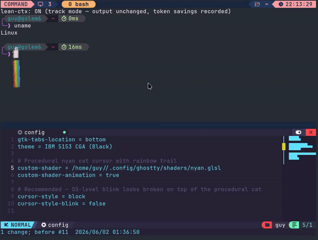

# Nyan Cursor Shader for Ghostty and Kitty

Custom cursor shaders for [Ghostty](https://ghostty.org) and [kitty](https://sw.kovidgoyal.net/kitty/) that turn your text cursor into 🌈 **Nyan Cat** 🐱 with a 6-stripe rainbow trail whenever it jumps.

The cat itself is drawn entirely procedurally with signed distance fields — no image textures. At the size of one terminal cell it reads as a tiny pop-tart with a grey cat head poking out and two wiggling legs. The rainbow is what really sells it.

## Demo



## Behavior

- **Idle**: normal terminal block cursor. No nyan.
- **Cursor jumps** (arrow keys, `Ctrl+A`/`Ctrl+E`, mouse click, scrolling, etc.): nyan flies in at the new cursor position with a rainbow streak connecting old → new, plus a few shimmer stars trailing behind.
- **After ~0.5 s of stillness**: nyan fades out and the default cursor returns.

The legs wiggle continuously while Nyan is visible (`sin(time * 14)`).

## Requirements

- **Ghostty ≥ 1.0** for [`shaders/nyan.glsl`](./shaders/nyan.glsl).
- **kitty ≥ 0.49** for [`shaders/kitty/nyan.slang`](./shaders/kitty/nyan.slang). Custom shaders were added in kitty 0.49.
- macOS or Linux — anywhere the corresponding terminal and its custom-shader API run.

## Install

### Ghostty

1. Drop the shader file somewhere Ghostty can read:

   **macOS:**
   ```sh
   mkdir -p "$HOME/Library/Application Support/com.mitchellh.ghostty/shaders"
   curl -fsSL https://raw.githubusercontent.com/guysoft/Ghostty-Nyan-Shader/main/shaders/nyan.glsl \
     -o "$HOME/Library/Application Support/com.mitchellh.ghostty/shaders/nyan.glsl"
   ```

   **Linux:**
   ```sh
   mkdir -p "$HOME/.config/ghostty/shaders"
   curl -fsSL https://raw.githubusercontent.com/guysoft/Ghostty-Nyan-Shader/main/shaders/nyan.glsl \
     -o "$HOME/.config/ghostty/shaders/nyan.glsl"

   # Most Linux Ghostty builds (GTK/OpenGL/Vulkan) use the opposite fragment
   # Y convention from macOS/Metal. If you skip this and the cat is upside
   # down, apply this line and reload Ghostty.
   sed -i 's/const float NYAN_Y_SIGN = -1.0;/const float NYAN_Y_SIGN = 1.0;/' \
     "$HOME/.config/ghostty/shaders/nyan.glsl"
   ```

2. Add to your Ghostty config (`~/Library/Application Support/com.mitchellh.ghostty/config` on macOS, `~/.config/ghostty/config` on Linux):

   ```conf
   # Procedural nyan cat cursor with rainbow trail
   custom-shader = ~/Library/Application Support/com.mitchellh.ghostty/shaders/nyan.glsl
   custom-shader-animation = true

   # Recommended — OS-level blink looks broken on top of the procedural cat
   cursor-style = block
   cursor-style-blink = false
   ```

   (On Linux, swap the `custom-shader` path for `~/.config/ghostty/shaders/nyan.glsl`.)

3. Reload Ghostty: **`⌘⇧,`** on macOS / **`Ctrl+Shift+,`** on Linux. If the shader doesn't appear, fully restart Ghostty.

4. If the cat is upside down, edit the top of `nyan.glsl` and flip the platform coordinate knob:

   ```glsl
   const float NYAN_Y_SIGN = 1.0;
   ```

   Default is `-1.0`, which matches the macOS/Metal behavior this shader was tuned on. Linux GTK/OpenGL builds commonly need `1.0`.

A ready-to-include snippet is in [`ghostty.example.conf`](./ghostty.example.conf).

### kitty

1. Install both the Slang shader and its pipeline in kitty's shader directory:

   ```sh
   mkdir -p "$HOME/.config/kitty/shaders"
   curl -fsSL https://raw.githubusercontent.com/guysoft/Ghostty-Nyan-Shader/main/shaders/kitty/nyan.slang \
     -o "$HOME/.config/kitty/shaders/nyan.slang"
   curl -fsSL https://raw.githubusercontent.com/guysoft/Ghostty-Nyan-Shader/main/shaders/kitty/nyan.pipeline \
     -o "$HOME/.config/kitty/shaders/nyan.pipeline"
   ```

2. Add these settings to `~/.config/kitty/kitty.conf`:

   ```conf
   cursor_trail 1
   cursor_trail_start_threshold 2 2
   custom_shaders nyan

   # Recommended: let the shader own the cursor animation.
   cursor_blink_interval 0
   ```

   `cursor_trail` must be enabled because kitty exposes cursor movement geometry to custom shaders through its trail system. The Nyan pipeline subscribes to that system and replaces kitty's built-in trail while active.

3. Reload kitty's configuration or restart kitty.

A ready-to-include snippet is in [`kitty.example.conf`](./kitty.example.conf).

## Uninstall / disable

- **Ghostty:** comment out the two `custom-shader*` lines and reload.
- **kitty:** comment out `custom_shaders nyan`. You can also disable `cursor_trail` if nothing else uses it.

## How it works

Both versions run as a post-process pass over the rendered terminal. For each fragment, they:

1. Sample the terminal contents underneath.
2. Compute an exponentially decaying visibility envelope from the most recent cursor movement time. Everything Nyan-related is gated on this so the effect is invisible when idle.
3. If the cursor moved far enough, draw a rainbow band along the previous → current cursor segment, sliced into 6 stripes (red/orange/yellow/green/blue/purple). The portion of the segment under the cat is cut out so the rainbow looks like it is coming out of Nyan's tail end.
4. Add a few jittered shimmer stars that drift along the trail.
5. Draw the cat (pop-tart body + procedural sprinkles + grey cat head + ears + eyes + cheeks + wiggling legs) centered at the current cursor.
6. Mask out the default block cursor underneath Nyan so they do not double up.

The host-specific inputs are mapped as follows:

| State | Ghostty GLSL | kitty Slang |
| --- | --- | --- |
| Current cursor | `iCurrentCursor` | `cursor_trail_edge` |
| Previous cursor | `iPreviousCursor` | `cursor_trail_prev_edge` |
| Movement time | `iTimeCursorChange` | `cursor_trail_change_time` |
| Terminal pixels | `iChannel0` | incoming `color` / backbuffer |
| Animation trigger | always animated | `cursor-trail-move` event |

The Ghostty coordinate convention follows [`KroneCorylus/ghostty-shader-playground`](https://github.com/KroneCorylus/ghostty-shader-playground)'s `cursor_smear.glsl`. The kitty port uses kitty's platform-independent lower-left, Y-up UV coordinates and converts them to pixel space before drawing.

## Limitations

- **Single-segment trail.** Only the last cursor jump leaves a streak — fast typing will not accumulate a long continuous rainbow. Both implementations intentionally track only the latest previous/current cursor pair.
- **Tiny at default font size.** At ~7×16 px per cell (11 pt JetBrains Mono on Retina) the cat is more "tiny pixel nyan" than detailed sprite. The rainbow does the heavy lifting visually. Scale your font up if you want more detail.
- **No external sprites.** The implementations do not load a Nyan Cat PNG. The whole cat is built from SDFs.
- **Selection / dim text under cursor.** The shaders run after the terminal composites everything, so Nyan overpaints selected text under the cursor. This is visible only during the brief animation.
- **Ghostty animation cost.** `custom-shader-animation = true` re-renders the screen at the display refresh rate while the window is focused. kitty's version is event-driven and only activates its shader group for cursor trails.

## Tweaking

Common Ghostty knobs in [`shaders/nyan.glsl`](./shaders/nyan.glsl):

| What | Where | Default |
| --- | --- | --- |
| Cat upside-down fix | `const float NYAN_Y_SIGN = -1.0;` | `-1.0` on macOS, try `1.0` on Linux |
| Trail lifetime (s) | `float trailLife = 0.7;` | `0.7` |
| Trail fade rate | `exp(-dt / trailLife * 2.5)` | `2.5` (higher = snappier) |
| Stripe band thickness | `float bandH = cell.y * 0.45;` | `0.45 ×` cursor height |
| Rainbow wave amplitude | `float waveAmplitude = cell.y * 0.12;` | `0.12 ×` cursor height |
| Cat size | `float s = min(cellSize.x, cellSize.y * 0.55);` in `drawNyan` | `≈` cursor cell |
| Leg wiggle speed | `sin(t * 14.0)` in `drawNyan` | `14` rad/s |
| Number of shimmer stars | `for (int i = 0; i < 3; i++)` | `3` |

The kitty equivalents are in [`shaders/kitty/nyan.slang`](./shaders/kitty/nyan.slang). Its main timing constants are `FLY_DURATION`, `CAT_LIFE`, and `TRAIL_LIFE` at the top of the file. kitty colors are converted from sRGB to linear RGB before compositing.

## Credits

- [Ghostty](https://ghostty.org) by Mitchell Hashimoto — the actual terminal and its custom-shader hook.
- [kitty](https://sw.kovidgoyal.net/kitty/) by Kovid Goyal — the Slang custom-shader pipeline and cursor-trail events used by the kitty port.
- [`KroneCorylus/ghostty-shader-playground`](https://github.com/KroneCorylus/ghostty-shader-playground) — reference for Ghostty's cursor-coordinate conventions.
- Nyan Cat © Christopher Torres / PRGuitarman — the original 2011 animation that this barely approximates.

## License

MIT. See [`LICENSE`](./LICENSE).
